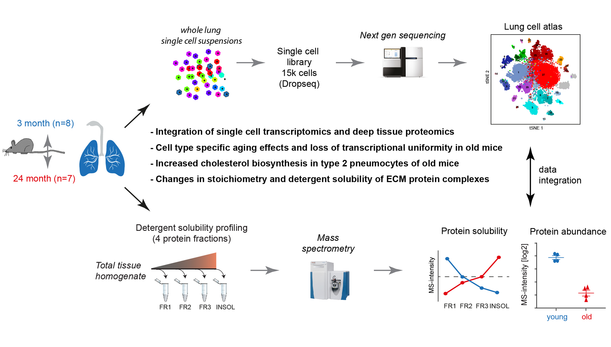

# An atlas of the aging lung mapped by single cell transcriptomics and deep tissue proteomics 

[Link](https://www.nature.com/articles/s41467-019-08831-9) to publication.

 

Aging promotes lung function decline and susceptibility to chronic lung diseases, which are the third leading cause of death worldwide. We used single cell transcriptomics and mass spectrometry to quantify changes in cellular activity states of 30 distinct cell types and the tissue proteome from lungs of young and old mice. Aging led to increased transcriptional noise, indicating deregulated epigenetic control. We observed highly distinct effects of aging on cell type level, uncovering increased cholesterol biosynthesis in type-2 pneumocytes and lipofibroblasts as a novel hallmark of lung aging. Proteomic profiling revealed extracellular matrix remodeling in old mice, such as increased collagen IV and XVI and decreased Fraser syndrome complex proteins and Collagen XIV. Computational integration of the aging proteome and single cell transcriptomes predicts the cellular source of regulated proteins and creates a first unbiased reference of the aging lung. The lung aging atlas can be accessed via an interactive user-friendly **[webtool](http://146.107.176.18:3838/MLAA_backup)**. By clicking on the link you agree with our data protection policy (as outlined [here](https://www.helmholtz-muenchen.de/en/imprint/index.html)).

Proteome raw data can be downloaded from the PRIDE repository under the accession number PXD012307. scRNA-seq, whole lung tissue bulk and flow-sorted cell populations bulk raw data can be downloaded from the Gene Expression Omnibus under the accession number GSE124872.

The code used to generate the webtool can be accessed at https://github.com/gtsitsiridis/lung_aging_atlas.

[Link](https://www.helmholtz-muenchen.de/ilbd/research/cpc-junior-research-groups/schiller-lab-dzl-junior-research-group/scientific-focus/index.html) to Schiller lab webpage. 

[Link](https://www.helmholtz-muenchen.de/icb/research/groups/machine-learning/overview/index.html) to Theis lab webpage. 

[Link](https://www.singlecell.de/) to single cell omics Germany network. 

This website was developed by [lkmklsmn](https://github.com/lkmklsmn) and [gtsitsiridis](https://github.com/gtsitsiridis).

 

